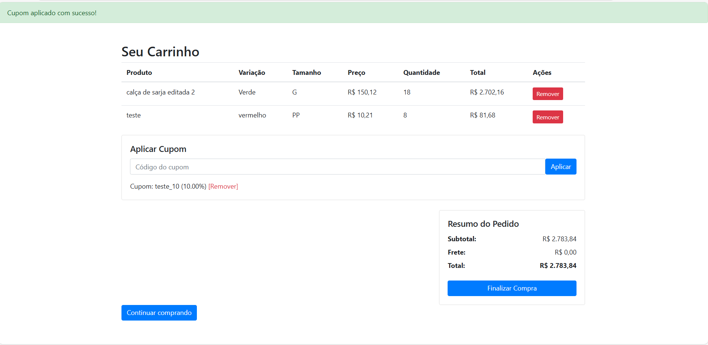
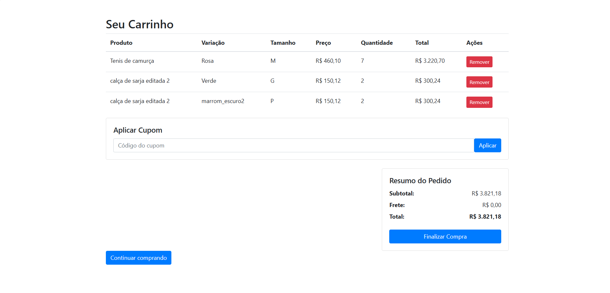
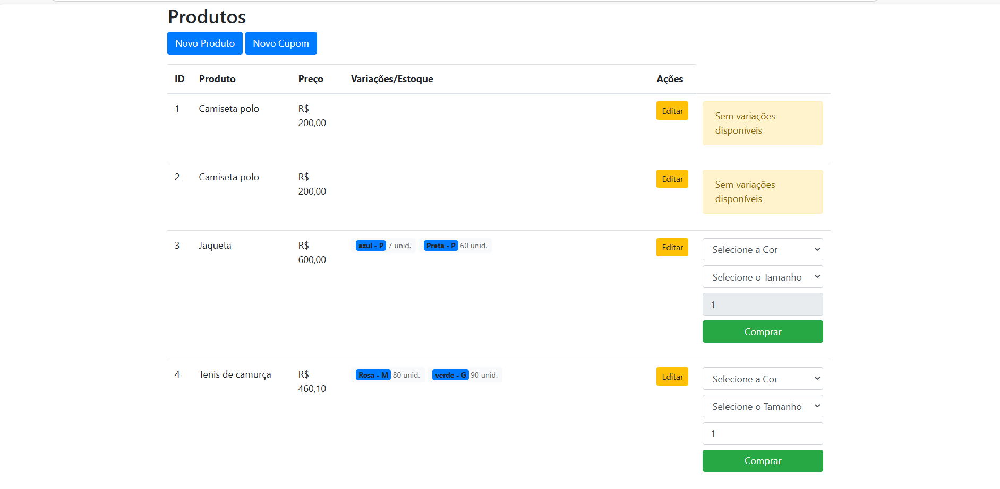
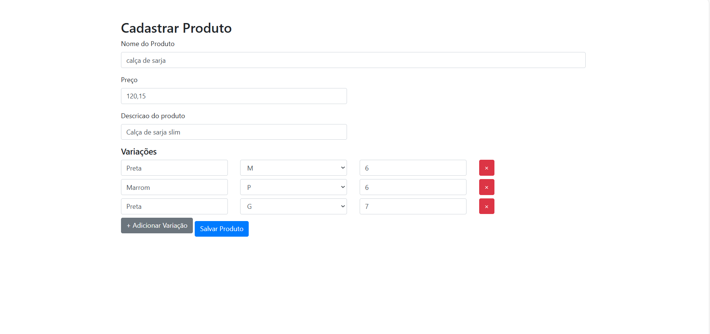
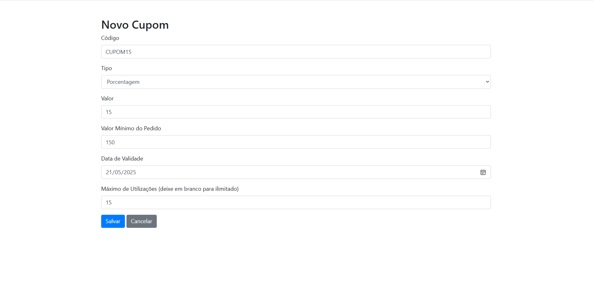
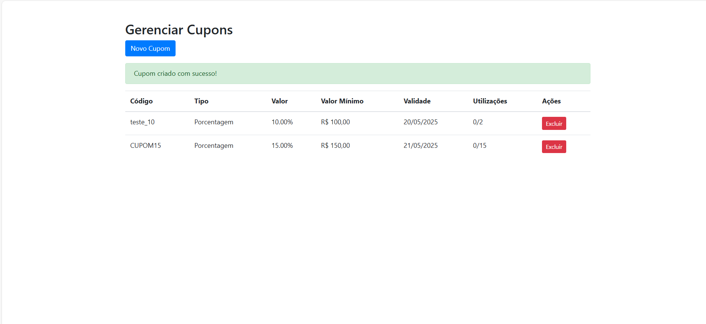
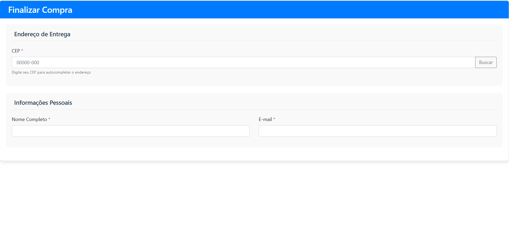
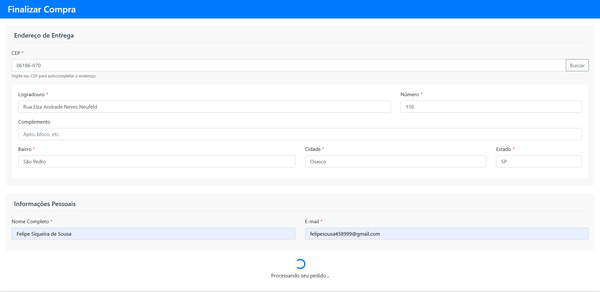
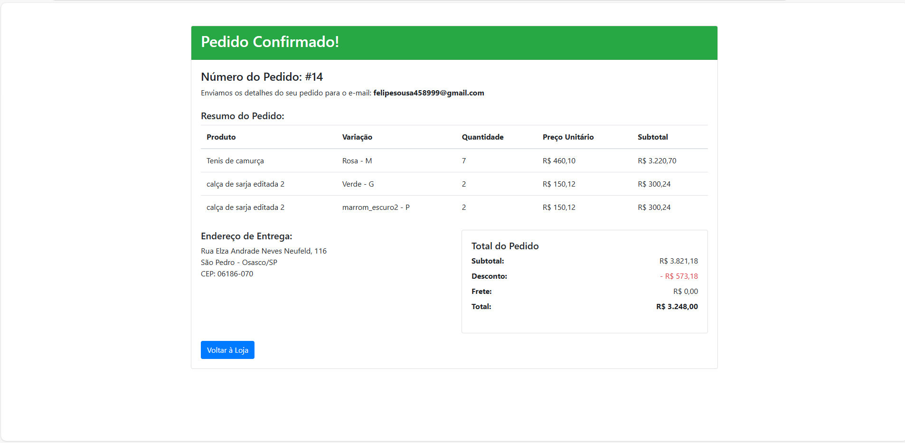
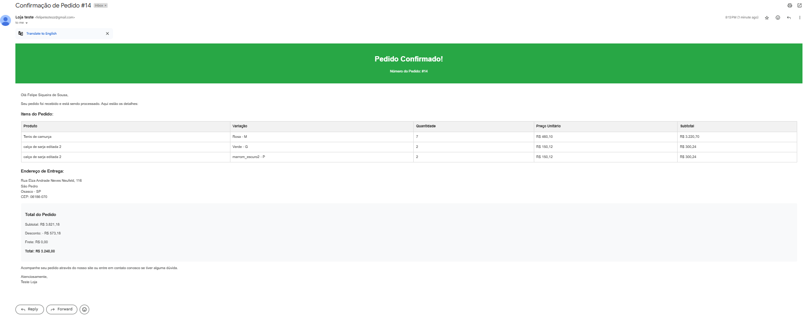

# 📦 Sistema de Pedidos - Imagens da Interface

> ⚠️ **Aviso importante:**  
> O método `enviar_email_confirmacao` no controller de pedidos precisa ser preenchido com as informações necessárias antes da finalização do fluxo de pedidos. Certifique-se de implementar a lógica de envio de e-mails com os dados corretos do pedido e do cliente.

---

## 🖼️ Telas do Sistema

### 🛒 Carrinho com cupom aplicado

### 🛒 Carrinho sem cupom

### 🧾 Lista de produtos

### ➕ Cadastro de produtos

### 🎟️ Criar cupom

### 🧑‍💼 Gerenciar cupons

### 📍 Endereço no checkout

### ✅ Endereço preenchido no checkout

### 🔄 Carregando checkout

### 📦 Confirmação do pedido

### 📧 Confirmação por e-mail

